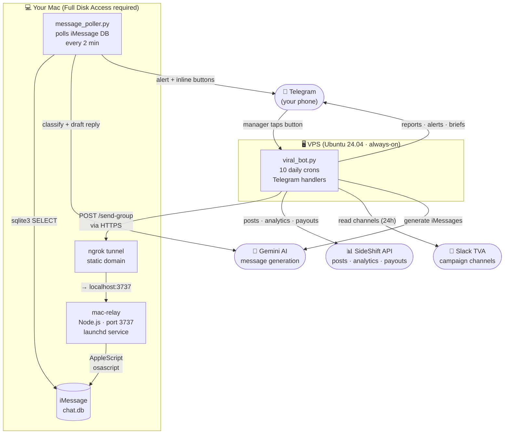
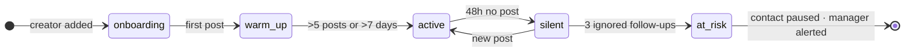
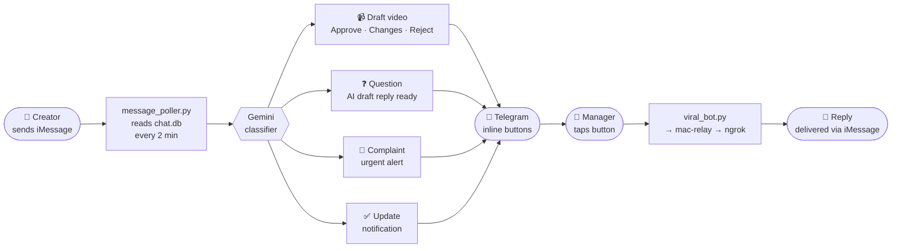
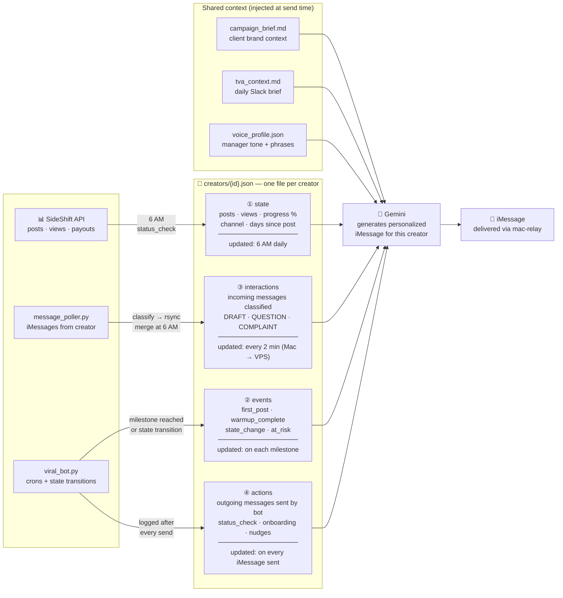

# VIRAL Agent

Autonomous UGC creator coordination system for The Viral App (TVA) managers.

Sends daily status updates to creators via iMessage, tracks post progress via SideShift, reads TVA Slack for campaign context, and reports everything to your Telegram.

---

## Install

**This system is installed entirely through Claude Code.** You don't run commands — Claude does everything for you.

### Step 1 — Open Claude Code

```bash
claude
```

### Step 2 — Paste this prompt

```
Install the VIRAL Agent on this Mac and VPS.
Repo: https://github.com/RubenLovera/viral-agent.git
Clone it to ~/VIRAL, read the CLAUDE.md inside, and follow the installation instructions step by step.
```

That's it. Claude will clone the repo, ask you for your credentials one by one, and set up everything — Mac-side and VPS — automatically.

**Installation takes ~30-45 minutes.**

---

## What you'll need before starting

Have these accounts/keys ready — Claude will ask for them one by one:

- [ ] VPS running Ubuntu 24.04 (IP + root password)
- [ ] Telegram bot token (create via @BotFather)
- [ ] SideShift API key (app.sideshift.app → Settings → API Keys)
- [ ] SideShift Program ID (your client's program)
- [ ] Gemini API key (aistudio.google.com)
- [ ] ngrok account (ngrok.com — free tier)

---

## How it works

### System architecture



### Creator pipeline

Creators move through 5 states. The bot adjusts its cadence automatically.



### Incoming message flow

Every iMessage a creator sends becomes a classified Telegram alert within 2 minutes.



### Creator memory

Each creator has a profile that builds up over time from multiple sources. When the bot generates a message, it reads all four layers and combines them with shared campaign context before calling Gemini.



---

## Daily schedule

| Time (PT) | What it does |
|-----------|-------------|
| 6:00 AM   | Status Check — personalized iMessage to each creator with their stats |
| 7:30 AM   | Slack Brief — reads TVA channels, sends summary to Telegram |
| 9:00 AM   | Morning Report — full campaign stats in Telegram |
| 10:00 AM  | Onboarding Check — nudges creators with 0 posts |
| 11:00 AM  | Buenos Días Check — mid-morning engagement |
| 2:00 PM   | Warm-up Check — monitors warm-up creators, nudges at-risk ones |
| 5:00 PM   | Overdue Check — flags creators who haven't posted today |
| 9:00 PM   | Nightly Digest — end of day summary |
| 1st of month | Voice profile regeneration reminder |
| Every 15 min | mac-relay health check |

## Telegram commands

| Command | What it does |
|---------|-------------|
| `/status` | Bot status + mac-relay health |
| `/report` | Run morning report now |
| `/statuscheck` | Send Status Check to all creators now |
| `/channelstate` | Show channel states for all creators |
| `/profile <name>` | Show creator's full profile |
| `/slackbrief` | Read Slack channels now |
| `/classify <text>` | Classify an iMessage (draft/question/complaint/update/other) |
| `/remap <name> <chat_id>` | Reassign creator's chat identifier |

## Multiple managers

Each TVA manager runs their own isolated instance — their own Telegram bot, SideShift key, ngrok domain, and creator roster. Multiple instances can run on the same VPS without interference.

To install for a new manager, they clone the repo and run `claude` from the directory.
