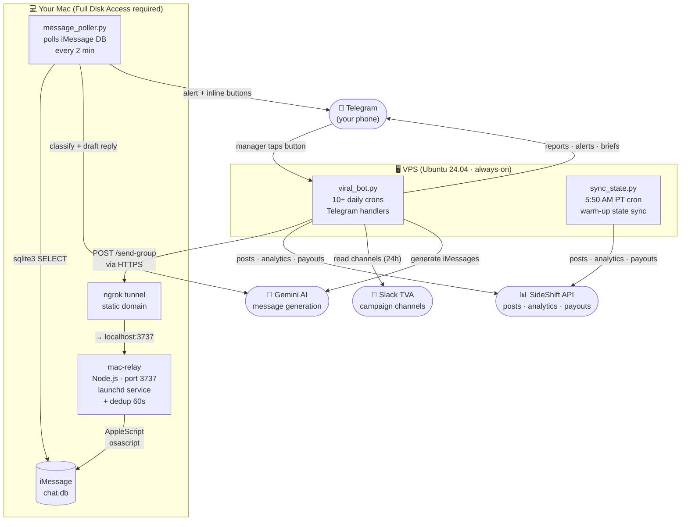
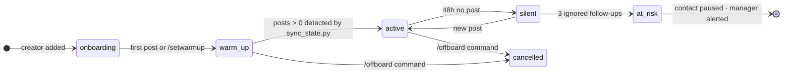
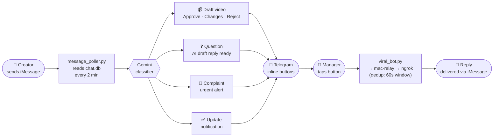
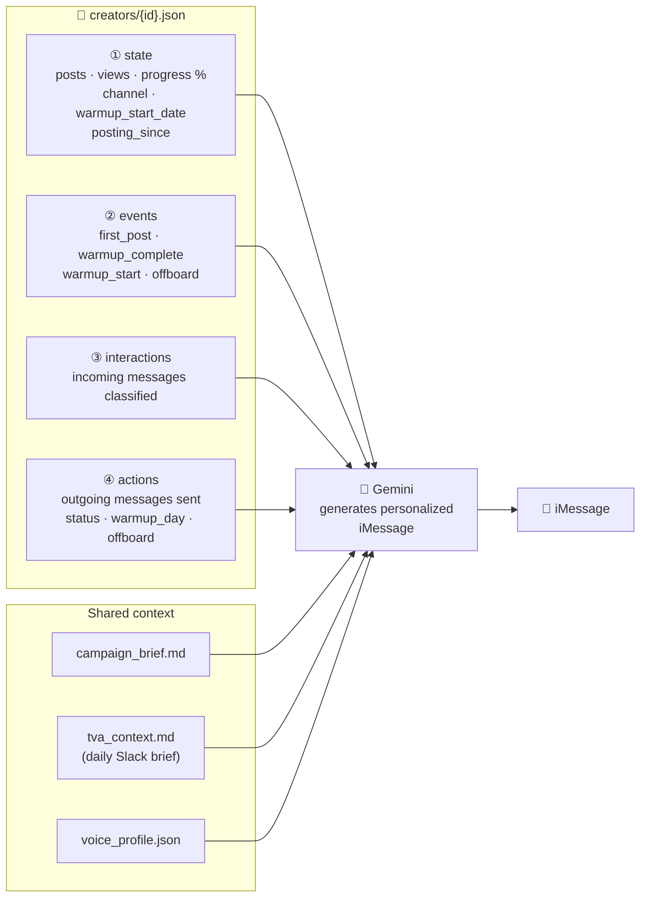

# VIRAL Agent

Autonomous UGC creator coordination system for The Viral App (TVA) managers.

Sends daily personalized iMessages to creators, tracks post progress via SideShift, manages a structured 3-day warm-up onboarding flow, handles off-boarding, reads TVA Slack for campaign context, and reports everything to your Telegram.

---

## Install

**This system is installed entirely through Claude Code.** You don't run commands — Claude does everything for you.

### Step 1 — Open Claude Code

```bash
claude
```

### Step 2 — Paste this prompt

```
Install the VIRAL Agent on this Mac and VPS.
Repo: https://github.com/RubenLovera/viral-agent.git
Clone it to ~/VIRAL, read the CLAUDE.md inside, and follow the installation instructions step by step.
```

That's it. Claude will clone the repo, ask you for your credentials one by one, and set up everything — Mac-side and VPS — automatically.

**Installation takes ~30-45 minutes.**

---

## What you'll need before starting

Have these accounts/keys ready — Claude will ask for them one by one:

- [ ] VPS running Ubuntu 24.04 (IP + root password)
- [ ] Telegram bot token (create via @BotFather)
- [ ] SideShift API key (app.sideshift.app → Settings → API Keys)
- [ ] SideShift Program ID (your client's program)
- [ ] Gemini API key (aistudio.google.com)
- [ ] ngrok account (ngrok.com — free tier)

---

## How it works

### System architecture



### 3-Day warm-up pipeline

New creators go through a structured 3-day warm-up before posting. The bot guides them day by day with specific tips.

```
Day 0  → onboarding_check (10 AM):
         "Welcome! We'll start with a 3-day warm-up. Stay tuned."

Day 1  → /setwarmup <creator>  (manager triggers manually)
         warmup_check (2 PM): "Scroll your FYP 20-30 min, engage with beauty content"

Day 2  → warmup_check (2 PM): "Post 1-2 of your own videos (not the campaign) for credibility"

Day 3  → warmup_check (2 PM): "More engagement + do you have a draft ready?"

Day 4+ → sync_state.py detects posts > 0 → clears warm-up → status_check resumes normally
```

### Creator pipeline

Creators move through 6 states. The bot adjusts its cadence automatically.



### Incoming message flow

Every iMessage a creator sends becomes a classified Telegram alert within 2 minutes.



### Creator memory

Each creator has a profile that builds up over time. When the bot generates a message, it reads all layers and combines them with shared campaign context.



---

## Daily schedule

| Time (PT) | What it does |
|-----------|-------------|
| 5:50 AM   | **sync_state.py** — clears warm-up when creator has posts, sets `posting_since` |
| 6:00 AM   | Status Check — personalized iMessage to each active creator with their stats |
| 7:30 AM   | Slack Brief — reads TVA channels, sends summary to Telegram |
| 9:00 AM   | Morning Report — full campaign stats in Telegram |
| 10:00 AM  | Onboarding Check — Day 0 warm-up invitation to new creators |
| 11:00 AM  | Buenos Días Check — mid-morning engagement check |
| 2:00 PM   | **Warm-up Check** — day-specific tips (Day 1/2/3) to confirmed warm-up creators |
| 5:00 PM   | Overdue Check — flags creators who haven't posted in 24h |
| 9:00 PM   | Nightly Digest — end of day summary |
| 1st of month | Voice profile regeneration reminder |
| Every 15 min | mac-relay health check |

---

## Telegram commands

| Command | What it does |
|---------|-------------|
| `/status` | Bot status + mac-relay health |
| `/report` | Run morning report now |
| `/statuscheck` | Send Status Check to all creators now |
| `/channelstate` | Show channel states for all creators |
| `/profile <name>` | Show creator's full profile |
| `/slackbrief` | Read Slack channels now |
| `/warmup` | Run warm-up check now |
| `/setwarmup <name> [YYYY-MM-DD]` | Start 3-day warm-up for a creator (defaults to today) |
| `/offboard <name> [--no-msg]` | Move creator to off-campaign + send farewell iMessage |
| `/classify <text>` | Classify an iMessage (draft/question/complaint/update/other) |
| `/remap <name> <chat_id>` | Reassign creator's chat identifier |

---

## Quality guards

- **FORBIDDEN_STRINGS** — aborts any message containing internal labels (OFF CAMPAIGN, DO NOT CONTACT, etc.)
- **English-only** — all LLM-generated messages are forced to English regardless of input language
- **Fresh post counts** — always reads live API data, never cached contract fields
- **Dedup relay** — mac-relay suppresses duplicate sends within 60 seconds (prevents VPS timeout+retry double-sends)
- **Outreach guard** — `send-imessages.py` skips creators already active in SideShift

---

## creators_map.json format

The bot uses a **dict format** keyed by creator name:

```json
{
  "Jersey Wilson": {
    "chat_identifier": "chat+XXXXXXXXXXXXXXXXXXXXXXXXXXXXXXXX",
    "sideshift_id": "CONTRACTOR_ID",
    "contract_status": "active",
    "warmup_start_date": "",
    "posting_since": "2026-06-01"
  }
}
```

Key fields:
- `contract_status`: `active` | `pending` | `outreach` | `cancelled`
- `warmup_start_date`: set by `/setwarmup`, cleared by `sync_state.py` when posts > 0
- `posting_since`: set by `sync_state.py` when creator first posts

---

## Multiple managers

Each TVA manager runs their own isolated instance — their own Telegram bot, SideShift key, ngrok domain, and creator roster. Multiple instances can run on the same VPS without interference.

To install for a new manager, they clone the repo and run `claude` from the directory.

---

## Updating

On your Mac:
```bash
git -C ~/VIRAL pull
```

On the VPS (ssh in or via the bot):
```bash
git -C /root/viral-agent pull
systemctl restart viral-bot-<your-slug>
```
